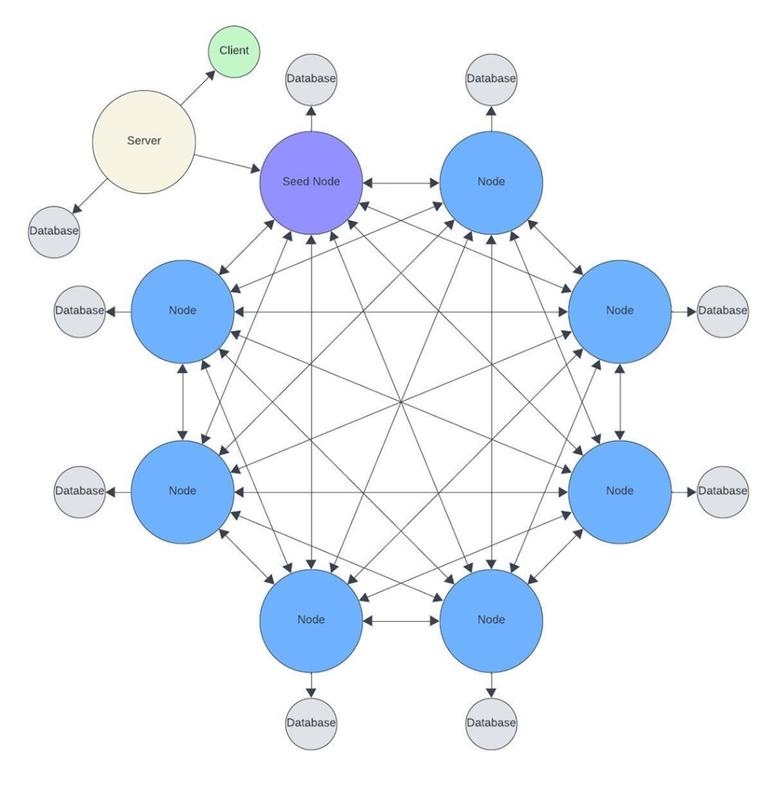
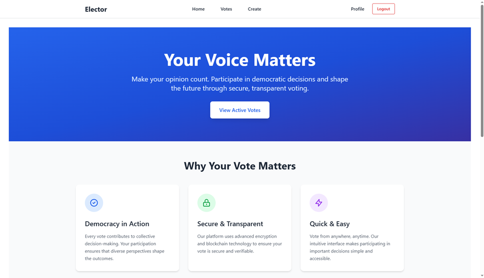

# Elector

Monorepo for **Elector**, a web platform for **secure, transparent electronic voting**. The product messaging emphasizes democratic participation, ease of use, and trust: votes are meant to be **verifiable** and protected using **cryptography** and **blockchain-backed** storage, while everyday actions (browsing elections, creating polls, managing a profile) stay simple for end users.

## About the project

The system is designed as a **multi-tier decentralized architecture** with a clear **separation of concerns**:

- **Presentation layer (React SPA)** — runs in the browser so voters do not need special software; supports dynamic ballots and interactive flows without full page reloads.
- **Application layer (FastAPI backend)** — acts as an integration **gateway**: authentication, validation of input, session/token handling, and orchestration of calls to the blockchain network.
- **Immutability layer (blockchain / P2P nodes)** — each cast vote is recorded as a **transaction** on a distributed ledger so that, once accepted by the network, it cannot be altered or removed by a central administrator.

**Data split:** **PostgreSQL** holds off-chain data (users, profiles, election metadata, settings) for fast queries and a responsive UI. **Redis** supports short-lived auth state and caching. **Blockchain nodes** each maintain their own copy of the chain; the mesh-style P2P design avoids a single point of failure for vote records. In typical deployment, the **backend** connects to the network through a **seed node**, while the **client** talks only to the backend API.

**Main user-facing capabilities** (from the use-case model): sign up and sign in, manage profile, **create elections** (topic, options, schedule, visibility, re-vote rules where allowed), **browse active and past votes**, **cast a vote** (with the actual choice anchored on the blockchain), and **view results** derived from the distributed ledger.

This description aligns with the bachelor project design document *“6. Проєктування”* (Section 2 — research, architecture, use cases, data models, business rules, and UI concept).

## Architecture and UI

**High-level architecture** (client, gateway server with its database, P2P blockchain nodes with per-node databases and a seed node):

**Landing page** (“Your Voice Matters” — secure, transparent voting; navigation to votes, create flow, profile):

## Components

| Directory | Description | Documentation |
| --------- | ----------- | ------------- |
| `frontend/` | React SPA | [frontend/README.md](frontend/README.md) |
| `backend/` | REST API (`/api/v1/...`) | [backend/README.md](backend/README.md) |
| `blockchain/` | Blockchain node API | [blockchain/README.md](blockchain/README.md) |

Install, configuration, migrations, and how to run each part are described in the corresponding README.
